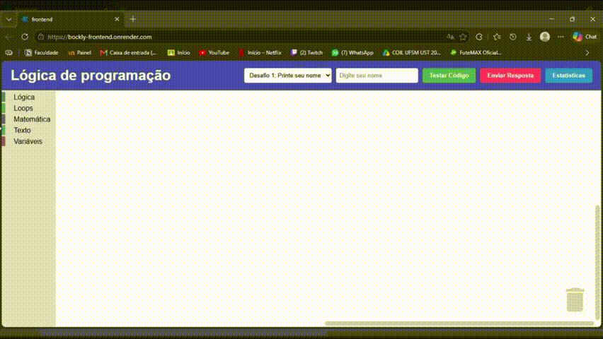

# Lógica em Blocos: Ranking de Desempenho



## Acesso

O projeto está hospedado no Render:
**URL:** [https://blockly-frontend.onrender.com/](https://blockly-frontend.onrender.com/)


## Desenvolvedor(a)
- Nome: Lucas Xavier Pairé
- Curso: Ciência da Computação


## Proposta
**Modalidade:** Mesmo problema, soluções diferentes.
Criar uma ferramenta educacional para crianças aprenderem lógica de programação. A aplicação web possui uma interface onde o aluno resolve desafios estáticos arrastando blocos visuais no estilo Scratch, usando a biblioteca BLockly. O frontend valida a lógica localmente, mas se comunica com o backend para persistir estatísticas (nome do jogador, quantidade de tentativas, número de blocos usados e desafio escolhido). O sistema lê essas informações do banco de dados e as exibe em formato de Ranking.


## Parceria/cliente/usuário
- Parceria Dev: Giovana Borelli 

## Feedback/comentário da parceria/cliente/usuário
(texto da giovana)

## Desenvolvimento

### Processo

#### Frontend

Primeiramente, quis entender como a biblioteca funcionava e o que eu precisaria escrever de código html, css e javascript para poder ver a tela com a área de trabalho e os blocos. ALém disso, eu não queria usar o React inicialmente para não complicar o meu entendimento da biblioteca.
Usei uma biblioteca chamada blockly que contém: a área de trabalho onde os blocos ficam, a montagem do menu lateral, quais blocos ficariam em determinada categoria, a lógica interna de cada bloco.
Então utilizei a IA para ler a documentação da biblioteca e pedi para ela me ensinar os fundamentos básicos, sem gerar código para mim, apenas me explicando e mostrando exemplos. 
Com isso, consegui desenvolver um frontend que possuia a área de trabalho, o menu lateral com 5 categorias (lógica, loops, matemática, texto e variáveis) e seus respectivos blocos.

Depois de ter desenvolvido apenas o frontend sem framework, comecei a adicionar o framework React e TypeScript para diferenciar minha versão do projeto com o da minha parceira.
Para instalar o projeto base do react, utilizei o Vite para baixar um template padrão de projeto que usa React. Removi arquivos padrões e desnecessários que eu não iria utilizar e deixei a a pasta do projeto limpa.

Então comecei a me deparar que o funcionamento do React muda a forma como eu estruturei os códigos do Blockly. Na primeira versão, eu apenas criava uma div vazia com um identificador e através do javascript eu injetava tudo da biblioteca Blockly dentro dela. Porém, no React as coisas não funcionam desse modo, pois ele gerencia a tela através do Virtual DOM, onde ele mantém uma cópia em memória do DOM e todas as alterações nessa cópia são refletidas no DOM real sem ter que fazer atualizações desnecessárias em parte que não mudaram.

Isso significa que se eu injetar o Blockly manualmente no DOM real, o React perde o controle daquela área. Na primeira vez que a tela sofresse uma atualização de estado, o React simplesmente apagaria toda a área de trabalho do Blockly.

Para resolver isso, eu precisaria usar recursos para gerenciar o estado e ciclo de vida de um componente. Só com esses recursos eu conseguiria amarrar a injeção do Blockly ao ciclo de vida do componente. Eu tenho um conhecimento bem básico do React, então pesquisando sobre quais recursos do React usar, acabei descobrindo a existência de uma biblioteca do Blockly para o React. Ela resolve exatamente esse problema descrito, encapsulando o blockly dentro de um componente React, isso resolveu o meu problema e facilitou no meu código ser mais limpo e declarativo.

#### Backend

Eu escolhi usar Java com Spring Boot e PostgreSQL, pois eu já tenho familiaridade por ter estagiado com essa stack de backend e por ter desenvolvido projetos pessoais com essa stack.

Como o frontend já validava os códigos do Blockly, fazendo uma conversão dos blocos em JavaScript e executando via função `eval`, eu precisava achar uma solução sobre o que o frontend iria consumir do backend para trabalhar com a persistência de dados.

Então com a observação da Professora, eu e minha parceira pensamos em criar dois endpoints no webservice:
- POST: para persistir estatisticas do usuário (Nome, Tentativas, Quantidade de blocos usados, Desafio, Data do envio).
- GET: para obter uma lista de todas as estatisticas salvas no banco de dados

Sobre o desenvolvimento utilizei uma Arquitetura em camadas no padrão: model, repository, DTO, Service e Controller. Para que siga o principio de responsabilidade única, onde cada camada sabe exatamente o seu dominio, sem saber o que outra camada sabe. Isso facilita separar a modelagem da entidade Estatistica, as queries no banco de dados, a transferência dos dados que entram e saem da API, as regras de negocio e validacao, as requisições HTTP.

#### Deploy

Para hospedagem, optei por centralizar tudo no Render. O deploy do frontend trouxe um pequeno problema no conflito de dependências, pois como eu estava usando o React 19 e a biblioteca do blockly exigia o React 18, na hora de subir o frontend o console do Render avisava que o build tinha falhado. A soluçlão foi mudar uma configuração do deploy para forçar a instalação ignorando o conflito.

Para o backend, o Render não tem suporte nativo para deploy de webservice em Java com Spring Boot, a solução foi envelopar todo o backend em um docker para então eu conseguir subir esse docker como webservice.

Para o banco de dados, o próprio Render oferece deploy nativo de um banco de dados PostgreSQL.

### Trechos de código

#### 1. Interceptando funções nativas do navegador:

A biblioteca Blockly gera código JavaScript que usa window.alert, mostrando um alerta na tela sem estilo css. Para resolver isso, eu intercepto o alerta antes de mostrar na tela, copio o valor daquele alerta, altero o estilo do alerta usando a biblioteca SweetAlert e depois injeto o valor para mostrar o alerta estilizado.

```tsx
const alertNativo = window.alert;
window.alert = (mensagem) => {
    mostrarAlerta('Saída do Código', String(mensagem), 'info', '#4caf50');
};
eval(codigoJS);
window.alert = alertNativo;
```

#### 2. Integração da API

Controlador isolado de lógicas de negócio, mantendo o principio de responsabilidade única,

```java
@RestController
@RequestMapping("/api/estatisticas")
@CrossOrigin(origins = "*")
public class EstatisticaController {
    
    @Autowired
    private EstatisticaService service;
    @PostMapping
    public ResponseEntity<EstatisticaDTO> salvar(@RequestBody EstatisticaDTO dto) {
        return ResponseEntity.ok(service.salvar(dto));
    }
}
```

#### 3. Isolamento da camada de rede no frontend

Criei um arquivo separado no frontend chamado api.ts que consome os endpoints do nosso webservice e mantem o principio de responsabilidade única.

```typescript
const apiClient = axios.create({
  baseURL: import.meta.env.VITE_API_URL || "http://localhost:8080/api/estatisticas"
});

export const api = {
  salvar: async (estatistica: Estatistica): Promise<void> => {
    await apiClient.post("", estatistica);
  },
  listar: async (): Promise<Estatistica[]> => {
    const resposta = await apiClient.get<Estatistica[]>("");
    return resposta.data;
  }
};
```

## Tecnologias

### Linguagens e afins
- **Frontend:** React, TypeScript, CSS.
- **Bibliotecas:** `react-blockly`, `axios`, `sweetalert2`.
- **Backend:** Java 21, Spring Boot.
- **Banco de Dados:** PostgreSQL 15.

### Ambiente de desenvolvimento
- Intellij IDEA
- Docker Desktop
- Render

## Referências e créditos
- Documentação do React Blockly. (https://www.npmjs.com/package/react-blockly)
- Google Gemini

---
Projeto entregue para a disciplina de [Desenvolvimento de Software para a Web](http://github.com/andreainfufsm/elc1090-2026b) em 2026b